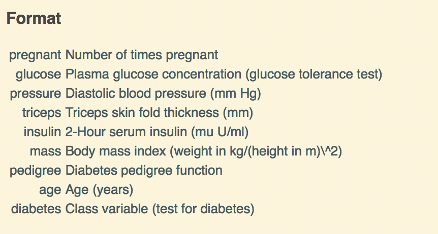

--- 
title: "Predictive Modeling"
author: "Steve Pittard"
email: wsp@emory.edu
affiliation: Department of Biostatistics and Bioinformatics
date: "`r Sys.Date()`"
bibliography:
- book.bib
- packages.bib
description: This is in support of the HERCULES Lecture Series.
documentclass: book
link-citations: yes
site: bookdown::bookdown_site
biblio-style: apalike
---

# Introduction {#intro}

Predictive Modeling is a type of Machine Learning which itself is a sub branch of Artificial Intelligence. The [following graphic](https://blogs.nvidia.com/blog/2016/07/29/whats-difference-artificial-intelligence-machine-learning-deep-learning-ai/
) provides us with some history of these domains. This is helpful if you are trying to orient yourself in the world of analytics and machine learning. Note that AI has been around for quite some time. The Wikipedia definition of AI is:

> The study of "intelligent agents": any device that perceives its environment and takes 
> actions that maximize its chance of successfully achieving its goals


## Machine Learning

Machine Learning relies upon "patterns and inference"" to "perform a specific task without using explicit instructions". It is a form of Applied AI that attempts to automatically learn from experience without being explicitly programmed. Think of Predictive Modeling as a subset of this which falls into two categories:

**Supervised**

Algorithms that build a model on a set of data containing both the inputs and the desired outputs (“labels” or known numeric values). When you want to map input to known output labels. Build a model that, when applied to “new” data, will hopefully predict the correct label. 


Some common techniques for Supervised learning include: Generalized Linear Models (GLM),
Logistic Regression, Random Forests, Decision Trees, Neural Networks, Multivariate Adaptive Regression Splines (MARS), and K Nearest Neighbors. 


**Unsupervised**

Algorithms that take a set of data that contains only inputs, and find structure in the data (e.g. clustering of data points) 

{width=500}

Some common techniques for unsupervised learning include: hierarchical clustering, k-means
clustering, mixture models, DBSCAN, Association Rules, Neural Networks

## Predictive Modeling

This lecture is concerned primarily with Predictive Modeling. Some examples of Predictive Modeling include:

  * Predict current CD4 cell count of an HIV-positive patient using genome sequences

  * Predict Success of Grant Applications

  * Use attributes of chemical compounds to predict likelihood of hepatic injury

  * How many copies of a new book will sell ?

  * Will a customer change Internet Service Providers ? 

In this domain there are generally two types of predictive models.

1) Classification for Predicting Qualitative Outcomes:

This relates to situations such as whether someone has a disease ("positive") or not ("negative"). The problem could also be multi classification such as assigning an organism to one of a number of possible species. 
    
2) Regression for Quantitative Out Comes 

This is when we wish to predict a numeric / continuous outcome such as a final sales price for a house or car. It might also be a prediction of tomorrow's stock or Bit Coin price. 

## In-Sample vs  Out-Of-Sample Error

The goal of predictive model is to generate models that can generalize to new data. It would be good if any model we generate could provide a good estimate of out of sample error. It's easy to generate a model on an entire data set (in sample data) and then turn around and use that data for prediction. But how will it perform on new data ? Haven't we just over trained our model ? 

## Performance Metrics

For either case (regression vs classification) we need some type of metric or measure to let us know how well a given model will work on new or unseen data - also known as "out of sample" data. for Classification problems we look at things like "sensitivity", "specificity", "accuracy", and "Area Under Curve". For Quantitative outcomes, we look at things like Root Mean Square Error (RMSE) or Mean Absolute Error (MAE). The selection of metric will frequently depend on your domain of interest. We'll use a couple of different methods. 

## Black Box

The good news is that you can treat building predictive models as a "Black Box".
The bad news is that you can treat building predictive models as a "Black Box".


# Getting Hands On


```{r init,message=FALSE}
library(tidyverse)
library(mlbench)
library(ROCR)
library(DataExplorer)
library(caret)
```


Let's consider the Pima Indians Data that is part of the **mlbench** package. You can install this package via the **Tools -> Install Package** menu item within R Studio or type the following at the R console prompt:

```{r mlbench,eval=FALSE}
install.packages("mlbench")
```

Once you have it installed then load it into the work space as follows:

```{r loadpima}
data("PimaIndiansDiabetes")

# Get a shorter handle. I hate typing. 
pm <- PimaIndiansDiabetes
```

The description of the data set is as follows:


{width=475}

So we now have some data on which we can build a model.  Specifically, there is a variable in the data called "diabetes" which indicates the disease / diabetes status ("pos" or "neg") of the person. It would be good to come up with a model that we could use with incoming data to determine if someone has diabetes. 


## Important Terminology

In predictive modeling there are some common terms to consider:

{width=475}

## Exploratory Plots

We'll look use some stock plots from the [**DataExplorer**](https://github.com/elastacloud/automatic-data-explorer) package to get a feel for the data. Look at correlations between the variables to see if any are strongly correlated with the variable we wish to predict or any other variables. 

```{r decorr}
plot_correlation(pm, type="continuous")
```


```{r debar}
plot_bar(pm)
```


```{r phist}
plot_histogram(pm)
```


```{r pbox}
plot_boxplot(pm,by="diabetes")
```

# A Common Modeling Workflow

The following graphic depicts the steps common to the Modeling Process. This is not the only way to proceed but it provides a very helpful schematic by which to plan your work. 

{height=600}


## Splitting The Data

A fundamental approach used in ML is to segment data into a "training" set which is some percentage of the original data - say 80%. The remaining 20% would be assigned to a "test" data set. Then we build a model on our training data set after which we use that model to predict outcomes for the test data set. This looks like the following. 

{width=500}

Note that some scenarios will split the data into three data sets: 1) training, 2) validation, and 3) test. This scenario is used when tuning so called hyper parameters for methods that have "tuning" parameters that could influence the resulting model. We'll stick with the basic "train / test" approach for now. 

Splitting the data is not particularly challenging. We can use the built in **sample** function in R to do this. We aren't sampling with replacement here which guarantees that no record can exist in both sets. That is, if a record from the data set is assigned to the training set, it will not be in the test data set. 

```{r createtesttrain}
# Make this example reproducible
set.seed(123) 
percent <- .80

# Get the indices for a training set.
idx <- sample(1:nrow(pm),round(.8*nrow(pm)),F)

# Use bracket notation to create the train / test pair
train <- pm[idx,]
test  <- pm[-idx,]

# The following should have 80 percent of the original 
# data

round(nrow(train)/nrow(pm)*100)

```

## First Model

Now let's build a Generalized Linear Model to do the prediction. We will employ logistic regression. 

```{r glmorig}
myglm <- glm(diabetes ~ .,
             data = train,
             family = "binomial")

summary(myglm)
```

In looking at the output we see some problems such as a number of predictors aren't significant so maybe we should eliminate them from the model. For now, we'll keep going because we are trying to outline the larger process / workflow. 

## First Prediction

We could now use this new model to predict outcomes using the test data set. Remember that we are attempting to predict a binary outcome - in this case whether the person is positive for diabetes or negative. 

What we get back from the prediction object are probabilities for which we have to determine a threshold above which we would say the observation is "positive" for diabetes and, below the threshold, "negative". 


```{r myglmpred}
probs <- predict(myglm,
                 newdata = test,
                 type = "response")

probs[1:10]
```

With logistic regression we are dealing with a curve like the one below which is a sigmoid function. The idea is to take our probabilities, which range between 0 and 1, and then pick a threshold over which we would classify that person as being positive for diabetes. 


```{r logitplot,echo=FALSE}
myseq <- seq(-6,6,.1)
myfunc <- function(x) {1/(1+exp(-x))}
plot(myseq,myfunc(myseq),
     type = "l",
     main = "Standard Logistic Sigmoid Function",
     ylab = "")
abline(h=0.5,lty=2)
abline(v=0,lty=2)
text(-0.5,0.55,"0.5")
grid()
```

### Selecting The Correct Alpha

The temptation is to select 0.5 as the threshold such that if a returned probability exceeds 0.5 then we classify the associated subject as being "positive" for the disease. But then this assumes that the probabilities are distributed accordingly. This is frequently not the case though it doesn't stop people from using 0.5. 

We might first wish to look at the distribution of the returned probabilities before making a decision about where to set the threshold. We can see clearly that selecting 0.5 in this case would not be appropriate. 

```{r bxplotalpha}
boxplot(probs, 
        main="Probabilities from our GLM Model")
grid()
```

The median is somewhere around .25 so we could use that for now although we are just guessing.  

```{r ifelse}
mypreds <- ifelse(probs > 0.25,"pos","neg")
mypreds <- factor(mypreds, levels = levels(test[["diabetes"]]))
mypreds[1:10]
```

### Confusion Matrices

Next, we would compare our predictions against the known outcomes which are stored in the test data frame:

```{r tablpreds}
# How does this compare to the truth ?
table(predicted = mypreds,
      actual = test$diabetes)
```

What we are doing is building a "Confusion Matrix" which can help us determine how effective our model is. From such a matrix table we can compute a number of "performance measures", such as accuracy, precision, sensitivity, specificity and others, to help assess the quality of the model. In predictive modeling we are always interested in how well any given model will perform on "new" data. 

There are some functions that can help us compute a confusion matrix.  Because the variable we are trying to predict, (diabetes), is a two level factor, ("neg" or "pos") we'll need to turn our predictions into a comparable factor. Right now, it's just a character string. 

```{r pred1}
# test$diabetes <- ordered(test$diabetes,c("pos","neg"))

mypreds <- factor(mypreds,
                  levels=levels(test$diabetes))

caret::confusionMatrix(mypreds,test$diabetes,positive="pos")
```

## Performance Measures Revisited

This is helpful stuff although there are a number of measures to select as a primary performance metric. Ideally, we would already know which performance metric we would select to effectively "judge" the quality of our model. In medical tests, "sensitivity" and "specificity" are commonly used. Some applications use "Accuracy" (which isn't good when there is large group imbalance). Anyway, if, for example, we pick "sensitivity" as a judge of model quality we see that is somewhere around .87. 
(A much deeper discussion about selecting the best performance measure is in order but we'll keep moving for now)

The problem here is that all we have done is looked at the confusion matrix corresponding to one specific (and arbitrary) threshold value when what we need is to look at a number of confusion matrices corresponding to many different thresholds. For example, we might get a better sensitivity level had we selected the mean of the returned probabilities. This process could go on and on and on... So we would benefit from a rigorous approach to find the "best" threshold. 

## The ROC curve

One way to do this is to use something known as the ROC curve. Luckily, R has functions to do this. This isn't surprising as it is a standard tool that has been in use for decades long before the hype of AI and ML was around. The ROC curve gives us a "one stop shop" for estimating a value of alpha that results in maximal area under a curve. 

In fact, maximizing the area under a given ROC curve winds up being an effective way to judge the differences between one method and another. So, if we wanted to compare the glm model against a Support Vector Machine model, we could use the respective AUC (Area Under Curve) metric to help us. This isn't the only way to do this but it's reasonable for now. 

```{r rocrcalc}
pred <- ROCR::prediction(predictions = probs,
                         labels = test$diabetes)

perf <- performance(pred,
                    "tpr",
                    "fpr")
plot(perf,colorize=T,
     print.cutoffs.at=seq(0,1,by=0.1),
     lwd=3,las=1,main="Cool ROC Curve")
abline(a = 0, b = 1)

grid()

myroc <- performance(pred,measure="auc")
myroc@y.values[[1]]

```

So what value of alpha corresponds to the stated max AUC of .80 ? We'll have to dig into the performance object to get that but it looks to be between 0.30 and 0.40. Note that this is somewhat academic since knowing the max AUC alone helps us decide if our model is any "good". For completeness we could use another R function to nail this down:


```{r proc,message=FALSE}
library(pROC)
proc <- roc(test$diabetes,probs)
round(coords(proc, "b", ret="t", transpose = FALSE),2)
```


# Other Methods ? 

Well, we could use another method to see if it yields better performance as determined by the AUC ? Let's use the **ranger** function which is a fast implementation of random forests. One thing you will notice is that we need to include the "probability" argument in the call to ranger to get the necessary probabilities for computing the AUC. This is one of the aggravations with using different functions. They all have their own peculiar way of doing things. 

```{r range1,message=FALSE}
library(ranger)
ranger_mod <- ranger(diabetes ~ .,
                   data = train,
                   probability = TRUE,mtry=4)

# Returns probabilities
ranger_pred <- predict(ranger_mod,data=test)

myroc <- roc(test$diabetes,
             ranger_pred$predictions[,2])

myroc$auc

pred <- ROCR::prediction(ranger_pred$predictions[,2],
                         test$diabetes)
perf <- performance(pred,
                    "tpr",
                    "fpr")
plot(perf,colorize=T,
        print.cutoffs.at=seq(0,1,by=0.1),
     lwd=3,las=1,main="Cool ROC Curve")
abline(a = 0, b = 1)

grid()

rroc <- performance(pred,measure="auc")
rroc@y.values[[1]]
```

It turns out that this didn't appear to improve things - at least with one invocation of the method. 

## Improving The Model(s)

We haven't accomplished very much here because we need to look at multiple versions of the data in case we sampled a number of outliers in the creation of our training data. Or, maybe we have excluded a large number of outliers in the training set so they wound up in the test data set which means that the predictive power of our model isn't as robust as it should be. 

Our next steps should involve creating multiple versions of the training and test pairs (say 3 times), compute the optimal AUC, and then look at how those values vary for each of those individual versions. If the AUCs vary widely then maybe our model is over training. If it's not varying widely, it could be that that the model has high bias. 

## Cross Fold Validation

This is a method that gives us multiple estimates of out-of-sample error, rather than a single estimate. In particular, we'll use an approach called "K-Fold Cross Validation" where we will partition our data into 3 individual "folds"" which are basically equal in size. Then we'll create a loop that does the following:

  - Combines 2 of the folds into a training data set
  - Builds a model on the combined 2-folds data
  - Applies the model to holdout fold
  - Computes the AUC value and stores it
  
Each fold is simply a portion of the data. We'll generate a list called "folds" that contains 3 elements each of which are 256 index elements corresponding to rows in pm. The way we did the sample insures that each row shows up only in one fold. 


To drive this home, and in case the graphic didn't help, consider the following simple data frame:

```{r ddf,echo=FALSE}
 df <- data.frame(id=paste(letters[1:9],1:9,sep=""),
                m1=round(runif(9),2),
                m2=round(runif(9),2),
                m3=round(runif(9),2))
df
```

If we created three folds out of this data frame it would look like the following:


Here is our function to implement the K-Fold validation. It's pretty straightforward to define in terms of coding though it winds up being  somewhat specific to the particular method we are using. 

```{r crossfoldfunc}
cross_fold <- function(numofolds = 3) {
  
  # Function to Do Cross fold validation
  
  # Split the data into K folds (numofolds)
  
  folds <- split(sample(1:nrow(pm)),1:numofolds) 
  
  # We setup some blank lists to stash results
  folddf    <- list()  # Contains folds
  modl      <- list()  # Hold each of the K models
  predl     <- list()  # Hold rach of the K predictions
  auc       <- list()  # Hold the auc for a given model
  
  # Create a formula that can be used across multiple
  # iterations through the loop. 
  
  myform <- "diabetes ~ ."
  
  for (ii in 1:length(folds)) {
    
    # This list holds the actual model we create for each of the 
    # 10 folds
    
    modl[[ii]] <- glm(formula = myform, 
                      data = pm[-folds[[ii]],],
                      family = "binomial"
    )
    
    # This list will contain / hold the models build on the fold
    
    predl[[ii]]  <- predict(modl[[ii]],
                            newdata=pm[folds[[ii]],],
                            type="response")
    
    # This list will hold the results of the AUC per iteration
    
    pred <- ROCR::prediction(predl[[ii]],
                             pm[folds[[ii]],]$diabetes)
    
    roc  <- performance(pred,measure="auc")
    auc[[ii]] <- roc@y.values[[1]]
  }
  return(unlist(auc))
}
```

Running this is now quite simple. By default, this function will loop three times corresponding to the number of folds. During each iteration it will:

  - use glm to build a model on the training folds
  - create a prediction object using the training fold
  - compute the underlying AUC associated with the prediction
  - store the AUC in a vector
  
At the end of the function, the vector containing the computed AUCs will be returned. 

```{r runcrossfold}
set.seed(123)
cross_fold()

# Use more folds
set.seed(123)
cross_fold(8)

```

We could take the average of the AUCs to get a sense of how well this method would apply to unseen data. 

```{r avgauc}
set.seed(123)
mean(cross_fold(8))
```

Let's plot the individual values:

```{r strip1}
stripplot(cross_fold(8),
          main="AUC values for K-Fold Validation",
          type=c("g","p"),pch=19,cex=1.5)

```


# Is There a Better Way ?

In R, as well as with Python, there are a growing number of packages available to help simplify repetitive processes. Building predictive models is no exception especially given that so many sub processes are involved such as splitting data, building a model, making a prediction, comparing it to the labelled data, and so on. The **caret** package provides an easy point of entry into the world of predictive modeling. It provides the following features:

    - Streamlined and consistent syntax for more than 
      200 different models
    - Can implement any of the 238 different methods using a single function
    - Easy data splitting to simplify the creation of train / test pairs
    - Realistic model estimates through built-in resampling
    - Convenient feature importance determination
    - Easy selection of different performance metrics (e.g. "ROC","Accuracy", "Sensitivity")
    - Automated and semi-automated parameter tuning
    - Simplifed comparison of different models
    
The caret package was designed specifically for predictive modeling and, in particular, to provide an intuitive approach to creating, managing, and comparing different models emerging from various methods. Let's work through our previous examples using functions from **caret**.

## Data Splitting Using Caret

Let's split the data into a training / test pair. The caret package provides some useful functions for this one of which is the **CreateDataPartition** function. 

```{r createpp}
idx <- createDataPartition(pm$diabetes,
                           p=.80,
                           list=FALSE)

Train <- pm[idx,]
Test  <- pm[-idx,]

nrow(Train)
```

Now we can use this to create a training object with caret. We'll create a GLM model similar to the one we've already created. The primary, and most frequently used, function in **caret** is the **train** function. In this example we'll use it build a model using the **glm** method. We will also specify that "Accuracy" will be the preferred performance measure. 


```{r mylmcaret}
myglm_caret <- train(diabetes ~ .,
                     data = Train,
                     method = "glm",
                     metric = "Accuracy")
myglm_caret
```

## Specifying Control Options

We can even request cross fold validation without having to write our own function to do this. To do this requires the specification of a "control" object which contains information that we would like for the **train** function to consider as it does its work. 

Not every invocation of **train** requires an associated **trainControl** object although as you become more experienced building models, you will frequently use this approach.

```{r myglmc}
control <- trainControl(method = "cv", number = 5)

myglm_caret <- train(diabetes ~ .,
                     data = Train,
                     method = "glm",
                     metric = "Accuracy",
                     trControl = control)
myglm_caret

```

## Inspecting The Model 

The object returned by caret has a great deal of information packed into it much of which is there to support reproducibility. Some key aspects of the object include, in this case, the Accuracy computation for each fold. 

```{r myglmr}
myglm_caret$resample
```

```{r myglmr2}
myglm_caret$results

# Note that the final reported Accuracy metric is simply the average of 
# the reported Accuracy values for each fold

myglm_caret$results[2] == mean(myglm_caret$resample$Accuracy)
```

Of course, you can always look at the model itself to get summary information just as you could if you were not using the **train** function. That is, the **caret** package does not try to conceal or replace what could be done using standard approaches. It overlays the model with information in a way that is transparent. 


```{r summglm}
summary(myglm_caret)
```

## How Well Did It Perform ?

Remember that one of the features of using caret is that it can help us estimate the out of sample error we will experience when applying our model to new or unseen data. The above model provides an estimate of out of band accuracy as .77

```{r printglm}
myglm_caret
```

Let's create a prediction object using the Test data to see how close we came to this estimate. It's a little worse than caret's estimate which is to be expected. Also, this is just an estimate using a single threshold when using the predict function. There are more sophisticated ways to estimate the accuracy. 

```{r predglm1}
mypreds_glm <- predict(myglm_caret, Test)

# Create a Table of known outcomes vs the predicted outcomes
outcome <- table(preds=mypreds_glm,actual=Test$diabetes)

(acc_outcome <- sum(diag(outcome))/sum(outcome))
```


## Comparing Performance Across Other Methods 

The advantage of the **train** function is that we can use the same control objects across a number of modeling techniques which then makes it easier to compare performance across various methods. 

As an example, instead of using the "glm" method we could pick another one such as Decision Tree. All we need to know is the name of the method we want. A complete list of supported models listed by category can be found [here](https://topepo.github.io/caret/available-models.html)

```{r rpart1}
control <- trainControl(method = "cv", number = 5)

myrpart_caret <- train(diabetes ~ .,
                     data = Train,
                     method = "rpart",
                     metric = "Accuracy",
                     trControl = control)
myrpart_caret
```

This method employs a Decision Tree approach which also involves use of "hyper parameters". However, at this point we don't really need to know much about those (although we should) when selecting the method. The larger point is that all we need to know is the name of the alternative method and we can reuse the previous **control** object.  

## Different Performance Measures

Not only can we easily select different methods we can also select different performance measures. It does require changes to the control object and arguments to the **train** function though we do not need to read the underlying help pages for a given method to do this. This is a true convenience and time saver that makes reproducing these experiments much easier. 

In this example we want to use the "Area Under Curve" (AUC) metric that comes from an associated ROC curve. To do this will require the model to generate class probabilities from which to build the ROC curve so this information needs to be specified in the control object. 

```{r diffperf1}
control <- trainControl(classProbs = TRUE,
                        summaryFunction = twoClassSummary,
                        method = "cv",
                        number = 8)

myglm_caret_roc <- train(diabetes ~ .,
                         data = Train,
                         method = "glm",
                         metric = "ROC",
                         trControl = control)

myglm_caret_roc
```

This is a true convenience and we don't have to use a separate R package to compute the AUC. It becomes a by product of the modeling process.  

Specifically, the control object can remain the same across different methods assuming that we wish to continue with classification. Here, we'll use Random Forests which are a generalization beyond a single Decision Tree. 

```{r rf1}
# The following is the same control object from before
control <- trainControl(classProbs = TRUE,
                        summaryFunction = twoClassSummary,
                        method = "cv",
                        number = 8)
# We'll 
myrf_caret <- train(diabetes ~ .,
               data = Train,
 #              method = "svmLinear",
               method = "rf",
               metric = "ROC",
               trControl = control)

myrf_caret
```

```{r plotrf}
plot(myrf_caret)
```

# Feature Importance

Another advantage of using the caret **train** function is that it provides a method to determine variable importance. This is useful when considering what features to include or not when building a model. If we summarize a given model, our myglm_caret model, we'll see that some of our predictors are not significant. 

We could use the **varImp** to use statistics generated by the specific modeling process itself. For more complex modeling techniques this winds up being very useful since digging into the model diagnostics can be daunting - although quite useful. 

```{r featimp}
varImp(myglm_caret)
```

If you wanted to see how the different models rates the significance of predictor variables then you can easily plot them. 

```{r plotfeat}
library(gridExtra)
p1 <- plot(varImp(myglm_caret),main="varImp for glm")
p2 <- plot(varImp(myrf_caret),main="varImp for Rf")
grid.arrange(p1,p2,ncol=2)
```

### Feature Elimination

The caret package also supports "recursive feature elimination" which automates the selection of optimal features. This can be controversial since such a process could work at the expense of important statistical considerations. However, it remains a tool in the Machine Learning toolbox. 

Let's work though an example of this using caret functions. First, we'll remove highly correlated predictor variables from consideration. We don't really have a lot of highly correlated variables. It turns out that "age" is correlated with "pregnant" at a level of 0.54. 

```{r elimfeat}
plot_correlation(pm[,1:8], type="continuous")

# find attributes that exceed some spcified threshold
highlyCorrelated <- findCorrelation(cor(pm[,1:8]),
                                    cutoff=0.5,
                                    names = TRUE)

# print indexes of highly correlated attributes
print(highlyCorrelated)
```

### The rfe Function

Let's apply the RFE method on the Pima Indians Diabetes data set. The algorithm is configured to explore all possible subsets of the attributes. All 8 attributes are selected in this example, although in the plot showing the accuracy of the different attribute subset sizes, we can see that just 4 attributes gives almost comparable results

```{r rfe1}
rfFuncs$summary <- twoClassSummary
control <- rfeControl(functions=rfFuncs, 
                      method="cv", 
                      number=4)

# run the RFE algorithm
results <- rfe(pm[,1:8], 
               pm[,9], 
               sizes=c(1:8), 
               rfeControl=control,
               metric="ROC")

# summarize the results
print(results)

# list the chosen features
predictors(results)

# plot the results
plot(results, type=c("g", "o"))
```

# Comparing Models

One of the more frequent activities in Machine Learning relates to setting up "shoot outs" between different models to see which one will perform the best. This is something we could do without **caret** but the package does help accomplish this using a standard interface. We'll keep using the Pima Indians Data and (re)build a few models. We'll use a common **control** object as well as a seed to maintain reproducibility.

```{r modcomp}
control <- trainControl(method="cv", 
                        number=5, 
                        summaryFunction = twoClassSummary,
                        classProbs = TRUE)

# Train the glm model
set.seed(7)
model_glm <- train(diabetes ~ ., 
                   data=pm, 
                   method="glm", 
                   metric="ROC",
                   trControl=control)

# Train the Decision Tree <odel
set.seed(7)
model_rpart <- train(diabetes~., 
                  data=pm, 
                  method="rpart", 
                  metric="ROC",
                  trControl=control)

# Train the Random Forest model
set.seed(7)
model_rf <- train(diabetes~., 
                  data=pm, 
                  method="rf", 
                  metric="ROC",
                  trControl=control)

# Train the knn model
set.seed(7)
model_knn <- train(diabetes~., 
                  data=pm, 
                  method="knn", 
                  metric="ROC",
                  trControl=control)

# Use the resamples function to prep for comparisons
results <- resamples(list(GLM   = model_glm, 
                          RPART = model_rpart, 
                          RF    = model_rf,
                          KNN   = model_knn))
```


Now we can easily look at how well the different models compare:

```{r summcomp}
# summarize the distributions
summary(results)
# boxplots of results
bwplot(results)
# dot plots of results
dotplot(results)
```


# Using Exeternal ML Frameworks

There are a number of companies that provide easy access to Machine Learning services including Google, Amazon, Data Robot, and H2o. In particular, the company H20.ai provides frameworks for accessible Machine Learning by experts and non-experts. They promote the idea of “citizen data science” which seeks to lower barriers to participation in the world of AI. While they have a commercial product, they also provide an open source tool:


> H2O is a fully open source, distributed in-memory machine learning platform with linear 
> scalability. H2O supports the most widely used statistical & machine learning algorithms 
> including gradient boosted machines, generalized linear models, deep learning and more.

Moreover, H2O provides access to an “Auto ML” service that selects methods appropriate to a given data set. This is useful to help jump start ideas.

> H2O also has an industry leading AutoML functionality that automatically runs through 
> all the algorithms and their hyperparameters to produce a leaderboard of the best models. 
> The H2O platform is used by over 18,000 organizations globally and is extremely popular 
> in both the R & Python communities.

Better yet, there is an R package called, somewhat unimaginatively, “h2o” “which provides:

> R interface for ‘H2O’, the scalable open source machine learning platform that offers 
> parallelized implementations of many supervised and unsupervised machine learning algorithms 
> such as Generalized Linear Models, Gradient Boosting Machines (including XGBoost), Random 
> Forests, Deep Neural Networks (Deep Learning), Stacked Ensembles, Naive Bayes, Cox 
> Proportional Hazards, K-Means, PCA, Word2Vec, as well as a fully automatic machine learning
> algorithm (AutoML).

## H2O In Action

The package must first be installed which can done using the install.packages function (or the menu in R Studio). Loading the library is done just as you would any other library.

```{r loadh2o, messages=FALSE}
library(h2o)
```

The goal of using this library is not to replace the methods available to you in R but, just like the caret package, seeks to provide a uniform interface for a variety of underlying methods. This includes common methods including an “Auto ML” service that picks methods for you. Let’s apply h2o to our work. The underlying h2o architecture uses a “running instance” concept that can be initialized and accessed from R. You initialize it once per interactive session.

```{r h2oinit}
h2o.init()
```


Once the h2o environment has been initialized then work can begin. This will take the form of using R functions provided by the h2o package to read in data and prepare it for use with various methods. Let’s repeat the regression on mtcars using h2o functions. Since mtcars is already available in the the R environment we can easily import it into h2o.

```{r}
# Import mtcars
mtcars_h2o_df <- as.h2o(mtcars)

# Idenitfy the variable to be predicted
y <- "mpg"

# Put the predictor names into a vector
x <- setdiff(colnames(mtcars_h2o_df),y)
```


## Create Some Models

Now let’s create some training and test data sets. We could do this ourselves using conventional R commands or helper functions from the caret package. However, the h2o package provides its own set of helpers.

```{r}
data(mtcars)
splits <- h2o.splitFrame(mtcars_h2o_df, ratios=0.8,seed=1)
train_h2o <- splits[[1]]
test_h2o  <- splits[[2]]

train_h2o
```


Now let’s create a model. We’ll use the Generalized Linear Model function from h2o. It is important to note that this function is implemented from within h2o. That is, we are not in anyway using any existing R packages to do this nor are we using anything from the care package. Here we’ll request a 4-Fold, Cross Validation step as part of the model assembly.

```{r h2oglm}
h2o_glm_model <- h2o.glm(y=y,x=x,train_h2o,nfolds=4)
summary(h2o_glm_model)
```


Now we can do a prediction on the object against the test set.

```{r h2opred}
(h2o_glm_preds <- h2o.predict(h2o_glm_model,test_h2o))
```


Now look at the performance diagnostics:

```{r h2operf}
h2o.performance(h2o_glm_model,test_h2o)
```

## Saving A Model

You can save the contents of any h2o generated model by using the h2o.saveModel() function. You could extract pieces of information from the S4 object but saving the model is easy to do - as is reading it back in.

```{r}
model_path <- h2o.saveModel(h2o_glm_model,path=getwd(),force=TRUE)

# If you need to load a previously saved model

saved_model <- h2o.loadModel(model_path)
```


## Using the Auto ML Feature

Are you curious as to what model might be the “best” for your data ? This is a very fertile field of research that keeps growing and some feel will one be the dominant technology in ML - where a model picks a model. Sounds odd but that is where it is heading. Check the current h2o Auto ML documentation for more details. For now, most of the Auto ML services use a set of heuristics to examine data and then find the most appropriate method to build a model. The currently supported method implementations in the opensource version include:


    - three pre-specified XGBoost GBM (Gradient Boosting Machine) models
    - a fixed grid of GLMs, a default Random Forest (DRF)
    - five pre-specified H2O GBMs
    - a near-default Deep Neural Net
    - an Extremely Randomized Forest (XRT)
    - a random grid of XGBoost GBMs
    - a random grid of H2O GBMs
    - a random grid of Deep Neural Nets.

## Launching A Job

Of course, it all begins with the idea of specifying a performance metric such as RMSE or the area under a ROC curve. The idea here is that we specify some input, apply transformations, create a test/train pair, and then call the h2o auto function.

```{r h2oautoml}
h2o_auto_mtcars <- h2o.automl(y = y, x = x,
                              training_frame = train_h2o,
                              leaderboard_frame = test_h2o,
                              max_runtime_secs = 60,
                              seed = 1,
                              sort_metric = "RMSE",
                              project_name = "mtcars")
```


Let’s check out the object that is returned. It is an S4 object in R which means that it has “slots” which can be accessed via the “@” operator.

```{r rhsoslots}
slotNames(h2o_auto_mtcars)
h2o_auto_mtcars@leaderboard
```

Stop the H2O instance

```{r h2ostop}
h2o.shutdown(prompt=FALSE)
```

